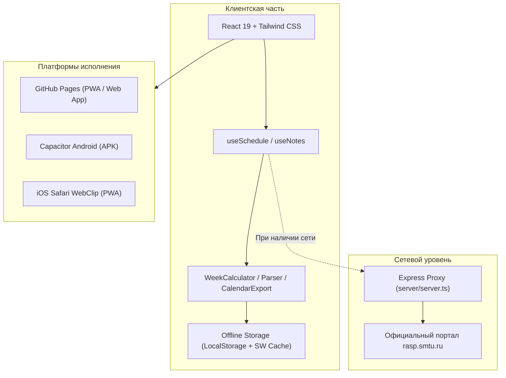

# ⚓ Расписание СПбГМТУ «Корабелка»

<div align="center">

[](https://github.com/Cryptoteep/smtu-schedule/actions/workflows/ci.yml)
[](https://github.com/Cryptoteep/smtu-schedule/actions/workflows/deploy.yml)
[](https://github.com/Cryptoteep/smtu-schedule/releases/latest)
[](LICENSE)
[](https://react.dev/)
[](https://www.typescriptlang.org/)
[](https://capacitorjs.com/)

**Современное кроссплатформенное приложение расписания для студентов и преподавателей Санкт-Петербургского государственного морского технического университета (СПбГМТУ).**

[🌐 Открыть веб-версию](https://cryptoteep.github.io/smtu-schedule/) • [📲 Страница загрузки (APK & PWA)](https://cryptoteep.github.io/smtu-schedule/download.html) • [📦 Релизы на GitHub](https://github.com/Cryptoteep/smtu-schedule/releases)

</div>

---

## ✨ Быстрый доступ и платформы

| Платформа | Формат | Ссылка / Способ установки |
| :--- | :--- | :--- |
| 🌐 **Веб-версия** | SPA (Vite + React 19) | [**Запустить онлайн на GitHub Pages**](https://cryptoteep.github.io/smtu-schedule/) |
| 📱 **Android** | Нативное приложение (APK) | [**Скачать APK с GitHub Releases**](https://github.com/Cryptoteep/smtu-schedule/releases/latest) |
| 🍏 **iOS (iPhone/iPad)** | PWA (Progressive Web App) | Откройте [онлайн-версию](https://cryptoteep.github.io/smtu-schedule/) в Safari → «Поделиться» → «На экран Домой» |
| 💻 **ПК (Win/Mac/Linux)** | Web Desktop + Hotkeys | В браузере (поддерживаются горячие клавиши `G`, `C`, `D`) |
| 📲 **Страница загрузки** | Интерактивный лендинг с QR | [**Открыть страницу загрузки**](https://cryptoteep.github.io/smtu-schedule/download.html) |

---

## 🚀 Основные возможности

1. **База данных всех факультетов Корабелки**:
   - 412 учебных групп по всем 8 факультетам:
     - **ФКиО** (Факультет кораблестроения и океанотехники)
     - **ФКИ** (Факультет корабельной энергетики и автоматики)
     - **ФЦТМТ** (Факультет цифровых промышленных технологий)
     - **ФГО** (Факультет гуманитарного образования)
     - **ИЭФ** (Инженерно-экономический факультет)
     - **ВФТШ** (Высшая физико-техническая школа)
     - **ИЛИСТ** / **ВУЦ** (Военный учебный центр)
     - **Колледж СПбГМТУ** (СТФ)
2. **Академический календарь и четность недель**:
   - Автоматический расчет текущей учебной недели и четности: **Верхняя (Числитель)** / **Нижняя (Знаменатель)**.
   - Фильтрация: *Текущая неделя*, *Числитель*, *Знаменатель*, *Все недели*.
3. **Таймер пар в реальном времени**:
   - Живой статус текущего занятия: *«Идёт пара (осталось 25 мин)»*, *«Перерыв (до пары 15 мин)»*.
4. **Справочник корпусов и аудиторий**:
   - Расшифровка литер корпусов СПбГМТУ:
     - **У** — Ульянка (Ленинский пр., 101)
     - **Л** — Лоцманская (ул. Лоцманская, 3)
     - **Г** — Горьковская (Кронверкский пр., 5)
     - **С** — Колледж (Ленинский пр., 101, стр. 4)
   - Встроенные ссылки на построение маршрута в Яндекс.Картах.
5. **Преподаватели**:
   - Просмотр преподавателя, карточки с фотографией, кафедры и аудиторий.
6. **Заметки и домашние задания**:
   - Персональные заметки, списки задач и дедлайны к конкретным парам с локальным сохранением.
7. **Экспорт в iCalendar (.ics)**:
   - Экспорт в 1 клик в Apple Calendar (iPhone/Mac), Google Calendar и Outlook с правильным повторением по четным/нечетным неделям.
8. **Автономность (Offline-First)**:
   - Полное кэширование расписания в браузере и на устройстве через Service Worker и LocalStorage. Приложение работает даже при отсутствии сети.

---

## 🏗 Архитектура проекта



---

## 🛠 Технологический стек

- **Frontend**: React 19, TypeScript, Vite, Tailwind CSS, Lucide Icons.
- **Мобильный рантайм**: Capacitor 7 (`@capacitor/android`, `@capacitor/core`).
- **Сетевой слой**: Node.js, Express, TSX, Fetch с кэшированием расписания.
- **Тестирование**: Vitest (покрытие парсера, расчета четности недель, экспорта в iCal и хранилища).
- **CI/CD**: GitHub Actions (автоматическая сборка, тестирование, публикация на GitHub Pages и сборка Android APK).

---

## ⚡ Быстрый старт для разработчиков

### 1. Клонирование и установка
```bash
git clone https://github.com/Cryptoteep/smtu-schedule.git
cd smtu-schedule
npm install
```

### 2. Запуск автоматических тестов
```bash
npm test
```

### 3. Запуск веб-версии
```bash
# В первом терминале (Express прокси кэша расписания):
npm run server

# Во втором терминале (Vite dev-сервер):
npm run dev
```

### 4. Сборка для Android
```bash
npm run build
npx cap sync android
npx cap open android
```

---

## 📜 Лицензия

Проект распространяется под свободной лицензией **MIT**. Подробнее см. в файле [LICENSE](LICENSE).
Разработано для студентов и преподавателей СПбГМТУ «Корабелка».
